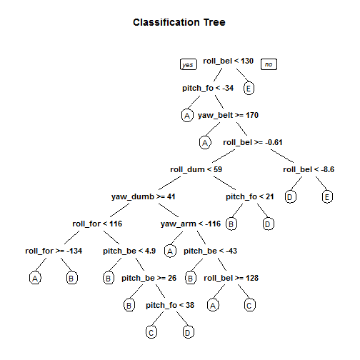

**Summary**
The data is loaded and cleaned. 12 features are selected -- the roll,yaw, and pitch readings of the four sensors. The rest of the data is summarization of these variables. Thus, only the basic actual values are chosen as predictors to avoid any multi-collinearity among the predictors. Small number of predictors prevents overfitting. The training data is split into training set (70%) and test set (70%).


```r
library(knitr)
library(caret)
library(ggplot2)
library(rpart.plot)
library(randomForest)
dTrain<-read.csv("~/pml-training.csv", header=T, na.string=c("",NA))
dTest<-read.csv("~/pml-testing.csv", header=T, na.string=c("",NA))

#selecting the roll,yaw, and pitch readings of the four sensors and the outcome variable -- classe.
val<-c(8,9,10,46,47,48,84,85,86,122,123,124,160)
dfTrain<-dTrain[,val]
inTrain<-createDataPartition(dfTrain$classe, p=0.7, list=FALSE)
dfSubTrain<-dfTrain[inTrain,]
dfSubTest<-dfTrain[-inTrain,]
```

**Models**
Four models are constructed with 12 predictors. 
-  Model 1: Model based prediction with linear discriminat analysis method
-  Model 2: Trees
-  Model 3: Random forests 
-  Model 4: Combination of above models

**1. Model based prediction**

```r
fit1<-train(classe~., data=dfSubTrain, method="lda")
pMBP<-predict(fit1,dfSubTest)
confusionMatrix(dfSubTest$classe, pMBP)
```

```
## Confusion Matrix and Statistics
## 
##           Reference
## Prediction    A    B    C    D    E
##          A 1134  159  113  175   93
##          B  306  310  151  216  156
##          C  324   68  400  109  125
##          D  124  162   87  434  157
##          E  211  254  216  171  230
## 
## Overall Statistics
##                                           
##                Accuracy : 0.4262          
##                  95% CI : (0.4135, 0.4389)
##     No Information Rate : 0.3567          
##     P-Value [Acc > NIR] : < 2.2e-16       
##                                           
##                   Kappa : 0.2681          
##  Mcnemar's Test P-Value : < 2.2e-16       
## 
## Statistics by Class:
## 
##                      Class: A Class: B Class: C Class: D Class: E
## Sensitivity            0.5403  0.32529  0.41365  0.39276  0.30223
## Specificity            0.8574  0.83191  0.87271  0.88912  0.83372
## Pos Pred Value         0.6774  0.27217  0.38986  0.45021  0.21257
## Neg Pred Value         0.7708  0.86452  0.88331  0.86365  0.88944
## Prevalence             0.3567  0.16194  0.16432  0.18777  0.12931
## Detection Rate         0.1927  0.05268  0.06797  0.07375  0.03908
## Detection Prevalence   0.2845  0.19354  0.17434  0.16381  0.18386
## Balanced Accuracy      0.6988  0.57860  0.64318  0.64094  0.56798
```

**2. Prediction with Tree**

```r
fit2<-rpart(classe~.,data=dfSubTrain, method="class")
pTree<-predict(fit2,dfSubTest, type="class")
confusionMatrix(dfSubTest$classe,pTree)
```

```
## Confusion Matrix and Statistics
## 
##           Reference
## Prediction    A    B    C    D    E
##          A 1184  218  163   97   12
##          B  109  657  189  178    6
##          C    3  130  851   42    0
##          D   13  232  223  469   27
##          E   20  211  160   67  624
## 
## Overall Statistics
##                                           
##                Accuracy : 0.6432          
##                  95% CI : (0.6308, 0.6554)
##     No Information Rate : 0.2695          
##     P-Value [Acc > NIR] : < 2.2e-16       
##                                           
##                   Kappa : 0.552           
##  Mcnemar's Test P-Value : < 2.2e-16       
## 
## Statistics by Class:
## 
##                      Class: A Class: B Class: C Class: D Class: E
## Sensitivity            0.8909   0.4537   0.5366  0.54982   0.9327
## Specificity            0.8924   0.8914   0.9593  0.90163   0.9122
## Pos Pred Value         0.7073   0.5768   0.8294  0.48651   0.5767
## Neg Pred Value         0.9656   0.8333   0.8487  0.92197   0.9906
## Prevalence             0.2258   0.2460   0.2695  0.14494   0.1137
## Detection Rate         0.2012   0.1116   0.1446  0.07969   0.1060
## Detection Prevalence   0.2845   0.1935   0.1743  0.16381   0.1839
## Balanced Accuracy      0.8917   0.6725   0.7479  0.72573   0.9225
```

```r
rpart.plot(fit2, main="Classification Tree")
```

 

**3. Prediction with Random forests***

```r
fit3<-randomForest(classe~.,data=dfSubTrain, method="class")
pRF<-predict(fit3,dfSubTest, type="class")
confusionMatrix(dfSubTest$classe,pRF)
```

```
## Confusion Matrix and Statistics
## 
##           Reference
## Prediction    A    B    C    D    E
##          A 1667    6    0    0    1
##          B   19 1102   18    0    0
##          C    0   13 1003    9    1
##          D    0    2    6  956    0
##          E    0    2    8    0 1072
## 
## Overall Statistics
##                                           
##                Accuracy : 0.9856          
##                  95% CI : (0.9822, 0.9884)
##     No Information Rate : 0.2865          
##     P-Value [Acc > NIR] : < 2.2e-16       
##                                           
##                   Kappa : 0.9817          
##  Mcnemar's Test P-Value : NA              
## 
## Statistics by Class:
## 
##                      Class: A Class: B Class: C Class: D Class: E
## Sensitivity            0.9887   0.9796   0.9691   0.9907   0.9981
## Specificity            0.9983   0.9922   0.9953   0.9984   0.9979
## Pos Pred Value         0.9958   0.9675   0.9776   0.9917   0.9908
## Neg Pred Value         0.9955   0.9952   0.9934   0.9982   0.9996
## Prevalence             0.2865   0.1912   0.1759   0.1640   0.1825
## Detection Rate         0.2833   0.1873   0.1704   0.1624   0.1822
## Detection Prevalence   0.2845   0.1935   0.1743   0.1638   0.1839
## Balanced Accuracy      0.9935   0.9859   0.9822   0.9945   0.9980
```

**4. Combining predictors**

```r
pred<-data.frame(pTree,pRF,pMBP, classe=dfSubTest$classe)
fitcom<-train(classe~.,data=pred,method="rf")
pCom<-predict(fitcom, dfSubTest)
confusionMatrix(dfSubTest$classe, pCom)
```

```
## Confusion Matrix and Statistics
## 
##           Reference
## Prediction    A    B    C    D    E
##          A 1667    6    0    0    1
##          B   19 1102   18    0    0
##          C    0   13 1003    9    1
##          D    0    2    6  956    0
##          E    0    2    8    0 1072
## 
## Overall Statistics
##                                           
##                Accuracy : 0.9856          
##                  95% CI : (0.9822, 0.9884)
##     No Information Rate : 0.2865          
##     P-Value [Acc > NIR] : < 2.2e-16       
##                                           
##                   Kappa : 0.9817          
##  Mcnemar's Test P-Value : NA              
## 
## Statistics by Class:
## 
##                      Class: A Class: B Class: C Class: D Class: E
## Sensitivity            0.9887   0.9796   0.9691   0.9907   0.9981
## Specificity            0.9983   0.9922   0.9953   0.9984   0.9979
## Pos Pred Value         0.9958   0.9675   0.9776   0.9917   0.9908
## Neg Pred Value         0.9955   0.9952   0.9934   0.9982   0.9996
## Prevalence             0.2865   0.1912   0.1759   0.1640   0.1825
## Detection Rate         0.2833   0.1873   0.1704   0.1624   0.1822
## Detection Prevalence   0.2845   0.1935   0.1743   0.1638   0.1839
## Balanced Accuracy      0.9935   0.9859   0.9822   0.9945   0.9980
```

**Results**

```r
pred<-predict(fit3, dTest)
pred
```

```
##  1  2  3  4  5  6  7  8  9 10 11 12 13 14 15 16 17 18 19 20 
##  B  A  B  A  A  E  D  B  A  A  B  C  B  A  E  E  A  B  B  B 
## Levels: A B C D E
```

**Conclusion**
Model 3 with random forests is the best model with highest prediction accuracy -- 99% with 95% CI (0.9852, 0.9909). Combining predictors do not facilitate any improved accuracy, and it might be lead to over fitting on the test data. The in sample error is observed (1%) by generating the confusion matrices for the predictions of the test data set that was splitted from the training data. 

**Submission**

```r
pml_write_files<-function(x){
  n<-length(x)
  for (i in 1:n){
    filename<-paste0("problem_id_",i,".txt")
    write.table(x[i],file=filename,quote=FALSE,row.names=FALSE,col.names=FALSE)
    }
  }
}

pml_write_files(pred)
```
